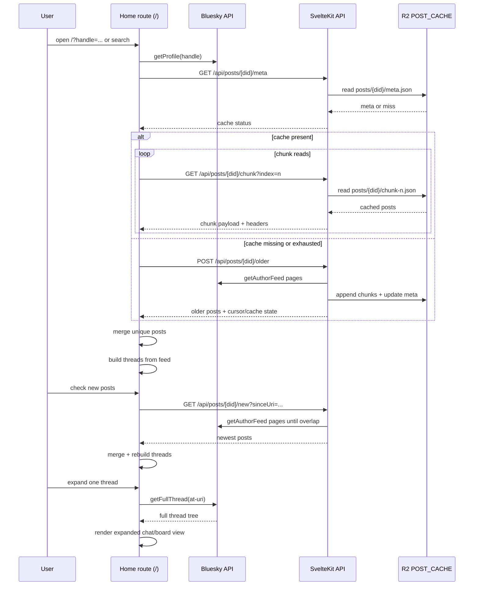
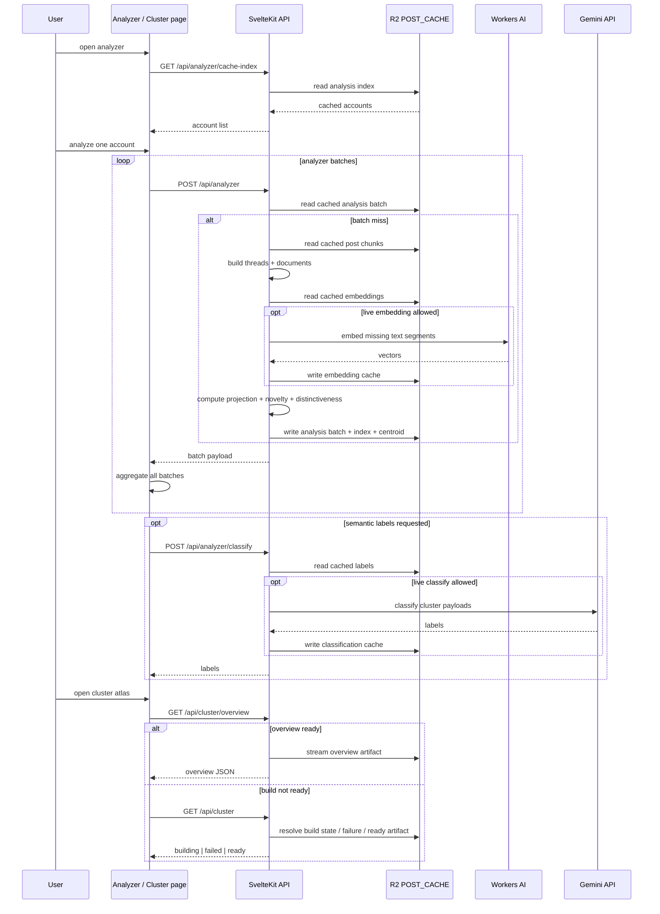

# atprotocodex AGENTS Guide

Last updated: 2026-03-08

This is the primary agent-facing architecture guide for this repository.
Use this file before changing code. Keep [CLAUDE.md](CLAUDE.md) as supporting context; this file is the fuller route/component/data-flow map for day-to-day implementation work.

## Product Summary

This repository is a SvelteKit application for exploring Bluesky threads in several visual forms and for running two analysis modes on cached thread data:

- `/`: discover long self-reply chains from one account feed
- `/chat`: render one full thread as a chat transcript
- `/board`: render one full thread as an explorable board
- `/analyzer`: run embedding-backed semantic analysis over one account's cached self-reply threads
- `/cluster`: browse a global snapshot built from cached analyzer output

The app is a hybrid of:

- client-side route logic that owns page state, route restoration, and visualization
- SvelteKit server endpoints that expose cache-backed or analysis-backed data
- direct client-side Bluesky API calls for profile lookup and full-thread hydration
- Cloudflare R2 and Workers AI bindings for persistent cache and embeddings

## Runtime And Deployment

### Tooling

- Framework: SvelteKit 2 + Svelte 5 runes
- Deployment target: Cloudflare Pages / Workers
- Adapter: `@sveltejs/adapter-cloudflare`
- Test runner: `node --test --import tsx`

### Manual Frontend Testing Boundary

- Do not use browser automation or the Browser Use plugin to inspect `/frontpage` unless explicitly requested.
- The user manually tests `/frontpage`; agents should make code changes and run build/check commands only.
- If a local server is needed, start it only when requested or approved, then provide the URL for the user to test.

### Platform Bindings

From [src/app.d.ts](src/app.d.ts):

- `POST_CACHE: R2Bucket`
- `AI: Ai`
- `FETCH?: '0' | '1'`
- `GEMINI_API_KEY?: string`

### Runtime Switches

- `FETCH='0'`
  - disables live Bluesky fetch in analyzer fallback paths
  - disables live Workers AI embedding requests
  - disables live Gemini classification
  - cached data can still be served
- `FETCH` unset or not `0`
  - live fetch and live analysis paths are allowed

### Rendering Mode

- [src/routes/+layout.js](src/routes/+layout.js): `prerender = false`
- [src/routes/+page.ts](src/routes/+page.ts): `ssr = false`
- [src/routes/chat/+page.ts](src/routes/chat/+page.ts): `ssr = false`
- [src/routes/board/+page.ts](src/routes/board/+page.ts): `ssr = false`, `prerender = false`
- [src/routes/analyzer/+page.ts](src/routes/analyzer/+page.ts): `ssr = false`
- [src/routes/cluster/+page.ts](src/routes/cluster/+page.ts): `ssr = false`

Implication:

- page logic runs entirely in the browser
- route restoration is done in `onMount`
- server endpoints are API providers, not Svelte page loaders

## Route To Endpoint Matrix

| Surface | Client entrypoint | Server endpoints | Direct Bluesky client calls | Storage / compute dependencies |
| --- | --- | --- | --- | --- |
| Home viewer `/` | [src/routes/+page.svelte](src/routes/+page.svelte) | `/api/posts/[did]/meta`, `/chunk`, `/new`, `/older`, `/api/cache-index` | `getProfile`, `getFullThread` | R2 post cache for feed slices; public Bluesky API for profile + full thread |
| Chat `/chat` | [src/routes/chat/+page.svelte](src/routes/chat/+page.svelte) | none | `getProfile`, `getFullThread` | public Bluesky API only |
| Board `/board` | [src/routes/board/+page.svelte](src/routes/board/+page.svelte) | none | `getProfile`, `getFullThread` | public Bluesky API only |
| Analyzer `/analyzer` | [src/routes/analyzer/+page.svelte](src/routes/analyzer/+page.svelte) | `/api/analyzer`, `/api/analyzer/cache-index`, `/api/analyzer/classify` | `getProfile`, `getProfiles` | R2 analyzer caches, embedding cache, Workers AI, optional Gemini |
| Cluster `/cluster` | [src/routes/cluster/+page.svelte](src/routes/cluster/+page.svelte) | `/api/cluster`, `/api/cluster/overview`, `/api/cluster/points/*`, `/api/cluster/thread` | `getProfile`, `searchActorsTypeahead` | R2 cluster artifacts, analyzer cache, cached post chunks |

Important exception:

- [src/routes/api/posts/[did]/+server.ts](src/routes/api/posts/%5Bdid%5D/+server.ts) is deprecated and returns `410`. Do not build new features around the old SSE contract.

## Frontend / Server Handshake

### Home Viewer Handshake

1. The page resolves a handle via `SearchBar` or route query params.
2. The page fetches profile metadata directly with `getProfile`.
3. The page checks R2 post-cache metadata through `/api/posts/[did]/meta`.
4. If cache exists, the page loads chunked feed data via `/api/posts/[did]/chunk?index=n`.
5. If cache is missing or incomplete, the page extends the cached feed through `/api/posts/[did]/older`.
6. The page rebuilds self-reply trees in-browser with `discoverThreads`.
7. The page supports incremental refresh via `/api/posts/[did]/new`.
8. When the user requests a full thread, the page bypasses the cache endpoints and fetches the full conversation directly with `getFullThread`.

Why this split exists:

- cache endpoints are optimized for account feed slices and repeated browsing
- direct `getFullThread` is optimized for one selected conversation and can hydrate truncated branches

### Chat / Board Handshake

1. The page receives a canonical Bluesky web URL in `url=...`.
2. The page resolves the handle with `getProfile`.
3. The page converts `{did, rkey}` into an AT URI.
4. The page calls `getFullThread` directly.
5. The chosen visual component renders the complete thread tree.

These pages do not use the cached feed endpoints.

### Analyzer Handshake

1. The page loads cached analyzed-account metadata from `/api/analyzer/cache-index`.
2. For one account, the page POSTs `{ did, maxPosts, threadOffset }` to `/api/analyzer`.
3. The server returns either:
   - one complete `ThreadAnalysisResult`, or
   - one `batch` payload with `nextThreadOffset`
4. The page loops until all batches arrive and aggregates them client-side.
5. If semantic labels are needed, the page POSTs cluster text to `/api/analyzer/classify`.
6. The route renders analysis state entirely in-browser via `AnalyzerPane` and optional `AnalyzerCompareOverlay`.

### Cluster Handshake

1. The page first attempts to fetch a ready overview from `/api/cluster/overview`.
2. If the overview is missing, the page asks `/api/cluster` for build state.
3. If the build is still in progress, the page polls `/api/cluster` every second.
4. Once ready, the page reloads overview and compact points from `/api/cluster/points/*`.
5. Selecting one point or representative triggers `/api/cluster/thread?did=...&rootUri=...`.
6. The thread endpoint tries analyzer cache first, then reconstructs from cached post chunks if needed.

## Sequence Diagrams

### Viewer Page Load And Cache Refresh

### Analyzer / Cluster Server-Backed Lifecycle

## Route Deep Dive

### `/` Home Viewer

Files:

- [src/routes/+page.svelte](src/routes/+page.svelte)
- [src/routes/+page.ts](src/routes/+page.ts)

Purpose:

- discover long self-reply chains from one account's author feed
- inspect discovered chains in multiple list render modes
- escalate to a full-thread view for one chosen thread

Entry query params:

- `handle`: account-only restore path
- `url`: canonical thread-specific deep link
- legacy `thread`: old root-URI restore path kept for compatibility
- legacy `from` / `to`: still readable by existing code paths but no longer part of the new deep-link contract

State ownership:

- profile selection and author metadata
- cache status (`cachedPostCount`, `cacheReachedEnd`)
- feed slice state (`lastFeedPosts`, `newPostsCursor`)
- rebuilt thread list (`allThreads`)
- filters (`threshold`, `searchQuery`, date filters)
- route restoration markers (`highlightedThread`, `pendingScrollToRootUri`, `active thread URL`)
- expanded full-thread state

Component composition:

- `SearchBar`: handle search and typeahead
- `CachedUsers`: browse previously cached accounts
- `SearchOptions`: optional date filters
- `ThresholdControl`: minimum thread depth
- `VirtualThreadList`: virtualized thread list with visual modes
- `LoadingSpinner`, `ErrorBanner`, `FontPicker`
- `GroupChat` and `BoardView` for expanded thread detail

Load sequence:

1. Read local font and render-mode preferences.
2. Parse route query params.
3. If `url` or legacy `handle` is present, resolve profile and trigger `handleSearch`.
4. Read cache status.
5. Load cached chunks or fetch older feed pages.
6. Rebuild threads in-browser.
7. If a deep-linked thread was requested:
   - highlight and scroll to it if present in discovered results
   - otherwise fetch full thread directly and open the expanded panel

Primary user actions:

- search by handle
- select a cached user
- check for new feed items
- load older feed items
- change visual mode
- filter by depth, text, and optional date range
- expand one thread into full-thread detail
- share one thread or open it on Bluesky

Failure and empty states:

- invalid or unresolved handle
- network failures during cache refresh
- no cached users
- no self-reply chains found
- full-thread fetch failure
- cache present but incomplete, requiring live older fetch

### `/chat`

Files:

- [src/routes/chat/+page.svelte](src/routes/chat/+page.svelte)
- [src/routes/chat/+page.ts](src/routes/chat/+page.ts)

Purpose:

- render one full Bluesky thread as a multi-author chat transcript

Entry query params:

- `url`: canonical Bluesky web URL for one post

State ownership:

- URL input text
- loading/error state
- one fetched full thread
- font preference

Component composition:

- `RouteNav`
- `FontPicker`
- `LoadingSpinner`
- `GroupChat`

Load sequence:

1. Restore font preference.
2. Read `url` from query params.
3. Parse handle + rkey from the Bluesky URL.
4. Resolve handle to DID with `getProfile`.
5. Build AT URI and fetch the full thread with `getFullThread`.
6. Render chat transcript.

Failure and empty states:

- invalid URL syntax
- handle resolution failure
- thread fetch failure
- truncated thread notice if the recursive hydration still leaves holes

### `/board`

Files:

- [src/routes/board/+page.svelte](src/routes/board/+page.svelte)
- [src/routes/board/+page.ts](src/routes/board/+page.ts)

Purpose:

- render one full Bluesky thread as a spatial board

Entry query params:

- `url`: canonical Bluesky web URL for one post

State ownership:

- URL input text
- loading/error state
- one fetched full thread
- font preference

Component composition:

- `RouteNav`
- `FontPicker`
- `LoadingSpinner`
- `BoardView`

Load sequence and failures:

- identical fetch flow to `/chat`
- different rendering path after `getFullThread`

### `/analyzer`

Files:

- [src/routes/analyzer/+page.svelte](src/routes/analyzer/+page.svelte)
- [src/routes/analyzer/+page.ts](src/routes/analyzer/+page.ts)

Purpose:

- analyze one account's self-reply threads with embeddings
- inspect clusters, novelty, and distinctiveness
- optionally compare two cached accounts

Entry query params:

- `handle`: primary analyzed account

State ownership:

- primary and secondary loaded accounts
- aggregated analyzer result batches
- cached-analysis index
- compare-mode state
- metric tab and shared sort controls
- compare-selection routing into child panes

Component composition:

- `RouteNav`
- `SearchBar`
- `AnalyzerPane`
- `AnalyzerCompareOverlay`
- `LoadingSpinner`, `ErrorBanner`, `FontPicker`

Load sequence:

1. Restore font preference.
2. Load cached analyzed-account index.
3. Resolve requested handle.
4. Loop over `/api/analyzer` batches until complete.
5. Aggregate coordinates, segments, metrics, and warnings client-side.
6. Render primary pane.
7. Optional: load a second cached account and overlay comparison charts.

Failure and empty states:

- unresolved handle
- server-side analyzer batch failure
- empty result set for first 1,000 feed items
- compare account not cache-eligible
- classification failure

### `/cluster`

Files:

- [src/routes/cluster/+page.svelte](src/routes/cluster/+page.svelte)
- [src/routes/cluster/+page.ts](src/routes/cluster/+page.ts)

Purpose:

- browse a precomputed cross-account cluster atlas
- filter by cluster or author
- inspect one representative or one cached thread

Entry query params:

- no stable v1 route contract yet

State ownership:

- overview payload
- compact point store and spatial index
- build progress / failure / missing states
- camera state for the atlas canvas
- selected cluster, author, hover, and thread inspector state

Component composition:

- `RouteNav`
- `LoadingSpinner`, `ErrorBanner`, `FontPicker`
- large inline visualization logic inside the route component

Load sequence:

1. Try overview endpoint.
2. If missing, ask `/api/cluster` for build state.
3. If building, poll until ready.
4. Load compact points.
5. Build spatial index and author lookup maps in-browser.
6. Fetch individual threads on demand through `/api/cluster/thread`.

Failure and empty states:

- cluster artifacts absent
- cluster build still running
- prior build failure
- compact points unavailable
- individual cached thread unavailable

## Component Catalog

### Shared Layout Components

#### `Lightbox`

File: [src/lib/components/Lightbox.svelte](src/lib/components/Lightbox.svelte)

- Responsibility: global image overlay for embedded media
- Inputs: `lightboxSrc` store
- Local state: current `src`
- Upstream data: image click handlers from chat/board/post components
- Downstream consumers: global layout in [src/routes/+layout.svelte](src/routes/+layout.svelte)
- Notes: closes on escape or backdrop click

#### `LoadingSpinner`

File: [src/lib/components/LoadingSpinner.svelte](src/lib/components/LoadingSpinner.svelte)

- Responsibility: generic phase/progress display
- Props: `progress`
- Local state: none
- Upstream data: all routes that perform asynchronous load phases
- Notes: supports known-total and unknown-total flows

#### `ErrorBanner`

File: [src/lib/components/ErrorBanner.svelte](src/lib/components/ErrorBanner.svelte)

- Responsibility: consistent error display card
- Props: `message`
- Local state: none

#### `FontPicker`

File: [src/lib/components/FontPicker.svelte](src/lib/components/FontPicker.svelte)

- Responsibility: font-family selector shared across routes
- Props: `value`, `onchange`
- Local state: none
- Upstream data: route-level preferred-font state

#### `RouteNav`

File: [src/lib/components/RouteNav.svelte](src/lib/components/RouteNav.svelte)

- Responsibility: top-level route switcher
- Props: `current`, `compact`, `align`, `threadUrl`, `handle`
- Local state: none
- Upstream data: current route and active thread/account context
- Notes: viewer pages preserve the canonical thread `url` when available; analyzer preserves `handle`

### Home Viewer Components

#### `SearchBar`

File: [src/lib/components/SearchBar.svelte](src/lib/components/SearchBar.svelte)

- Responsibility: account search box with typeahead
- Props: `onsearch`, `onprofile`, `disabled`, `initialHandle`
- Local state: input text, suggestion list, active suggestion index
- Upstream data: direct Bluesky `searchActorsTypeahead`, `getProfile`
- Downstream consumers: home viewer and analyzer
- Notes: resolves full profile on suggestion pick so parent routes get a DID immediately

#### `CachedUsers`

File: [src/lib/components/CachedUsers.svelte](src/lib/components/CachedUsers.svelte)

- Responsibility: browse R2-cached accounts
- Props: `onselect`
- Local state: expanded/loaded/loading flags, `users`
- Upstream data: `/api/cache-index` plus `getProfiles`
- Downstream consumers: home viewer

#### `SearchOptions`

File: [src/lib/components/SearchOptions.svelte](src/lib/components/SearchOptions.svelte)

- Responsibility: optional date filter UI
- Props: bindable `dateFrom`, `dateTo`
- Local state: panel expansion
- Notes: filter is client-side only; no server API involvement

#### `ThresholdControl`

File: [src/lib/components/ThresholdControl.svelte](src/lib/components/ThresholdControl.svelte)

- Responsibility: minimum thread-depth slider
- Props: bindable `value`, `min`, `max`
- Local state: none

#### `VirtualThreadList`

File: [src/lib/components/VirtualThreadList.svelte](src/lib/components/VirtualThreadList.svelte)

- Responsibility: virtualized rendering shell for discovered thread cards
- Props:
  - `threads`
  - `renderMode`
  - `highlightedThread`
  - `collapsedByRootUri`
  - callback props for collapse, expand, share, open-on-Bluesky, scroll completion, animation completion
- Local state:
  - measured row heights
  - viewport/window offsets
  - scroll target handling
- Upstream data: filtered thread list from home route
- Downstream consumers: `ThreadCard`, `ChatBubbles`, `ConspiracyBoard`, `RansomNote`
- Notes: avoids rendering the full thread list at once and keeps scroll-to-thread behavior coordinated with home route state

#### `ThreadCard`

File: [src/lib/components/ThreadCard.svelte](src/lib/components/ThreadCard.svelte)

- Responsibility: default render mode for one discovered thread
- Props: `thread`, `collapsed`, `oncollapsedchange`, optional `onexpand`, `onshare`, `onopenbluesky`
- Local state: derived stable rotation
- Downstream consumers: `PostNode`, `RoughBorder`

#### `PostNode`

File: [src/lib/components/PostNode.svelte](src/lib/components/PostNode.svelte)

- Responsibility: recursive thread tree renderer for the default mode
- Props: `post`, `level`
- Local state: derived indent
- Upstream data: `ThreadPost` tree
- Notes: supports image lightbox and external link cards

#### `RoughBorder`

File: [src/lib/components/RoughBorder.svelte](src/lib/components/RoughBorder.svelte)

- Responsibility: draw hand-drawn borders around slotted content
- Props: snippet `children`
- Local state: DOM refs
- Upstream data: uses `roughjs` to redraw on resize

#### `ChatBubbles`

File: [src/lib/components/modes/ChatBubbles.svelte](src/lib/components/modes/ChatBubbles.svelte)

- Responsibility: alternate thread-card mode using left/right chat bubbles
- Props: same shape as `ThreadCard`
- Local state: flattened post list
- Upstream data: `flattenThread`

#### `ConspiracyBoard`

File: [src/lib/components/modes/ConspiracyBoard.svelte](src/lib/components/modes/ConspiracyBoard.svelte)

- Responsibility: alternate thread-card mode that lays flattened posts out as a connected board
- Props: same shape as `ThreadCard`
- Local state: board element and SVG connector path
- Upstream data: `flattenThread`

#### `RansomNote`

File: [src/lib/components/modes/RansomNote.svelte](src/lib/components/modes/RansomNote.svelte)

- Responsibility: alternate thread-card mode that styles words with seeded random ransom-note typography
- Props: same shape as `ThreadCard`
- Local state: none beyond derived flattened list
- Upstream data: `flattenThread`

#### `GroupChat`

File: [src/lib/components/GroupChat.svelte](src/lib/components/GroupChat.svelte)

- Responsibility: full-thread chat transcript used by `/chat` and expanded home detail
- Props: `thread`, optional `fullHeight`
- Local state: derived flattened chat posts
- Upstream data: `flattenThreadForChat`
- Notes: inserts date separators and stable author colors

#### `BoardView`

File: [src/lib/components/BoardView.svelte](src/lib/components/BoardView.svelte)

- Responsibility: full-thread board used by `/board` and expanded home detail
- Props: `thread`
- Local state:
  - layout mode
  - zoom and pan state
  - minimap state
  - SVG connector path
- Upstream data: full thread tree
- Notes: supports horizontal/vertical layouts, panning by pointer drag, zoom controls, minimap interaction, and card line recomputation after layout changes

### Analyzer Components

#### `AnalyzerPane`

File: [src/lib/components/analyzer/AnalyzerPane.svelte](src/lib/components/analyzer/AnalyzerPane.svelte)

- Responsibility: the primary single-account analyzer UI
- Props:
  - `profile`
  - `result`
  - `segments`
  - `compareMode`
  - `paneId`
  - `selectionRequest`
  - shared metric control props
- Local state:
  - selected cluster/thread/segment
  - classification request state
  - novelty ordering and focus state
- Upstream data:
  - aggregated analyzer result from route
  - `/api/analyzer/classify` for semantic labels
- Downstream consumers:
  - inline scatter plot
  - metric chart
  - class/thread inspector panes
- Notes:
  - computes plot coordinates and labels client-side from analyzer payload
  - maps compare-overlay clicks back into pane-local selection

#### `AnalyzerCompareOverlay`

File: [src/lib/components/analyzer/AnalyzerCompareOverlay.svelte](src/lib/components/analyzer/AnalyzerCompareOverlay.svelte)

- Responsibility: overlay compare map and compare metric chart for two analyzed accounts
- Props: `primary`, `secondary`, bindable `metricTab`, `onSelectThread`
- Local state: derived overlay points only
- Upstream data: already-loaded analyzer results
- Downstream consumers: primary and secondary `AnalyzerPane`s via selection callbacks

### Cluster Surface

The cluster page keeps most of its visualization logic inside [src/routes/cluster/+page.svelte](src/routes/cluster/+page.svelte) rather than separate Svelte components. The route itself therefore acts as:

- overview loader
- compact-point decoder
- camera controller
- hover system
- author-search controller
- thread inspector coordinator

## Data Types And Shared Contracts

Primary shared types live in [src/lib/types/index.ts](src/lib/types/index.ts).

Important structures:

- `ThreadPost`: normalized post tree node used by all viewer surfaces
- `SelfReplyThread`: `{ rootPost, depth, rootUri }`
- `ThreadAnalysisResult`: analyzer payload with points, novelty, distinctiveness, and stats
- `ClusterOverview` / `ClusterSnapshot`: precomputed global cluster artifacts
- `ClusterInspectorThread`: thread payload used by `/api/cluster/thread`

Agent guidance:

- preserve these shapes where possible instead of creating route-specific parallel types
- add fields conservatively because the same types are consumed by multiple pages

## Algorithms

### 1. Feed Cache Loading And Merge / Dedup

Code:

- [src/lib/api/cache.ts](src/lib/api/cache.ts)
- [src/routes/+page.svelte](src/routes/+page.svelte)

Current behavior:

1. Read cache metadata from `/meta`.
2. Read chunk pages from `/chunk`.
3. Track uniqueness by post URI, then CID, then synthetic fallback keys.
4. Merge cached seed posts with fresh pages in append or prepend order.
5. Respect `CACHE_CHUNK_SIZE = 1000`.
6. Use `newPostsCursor` only for repeated `/new` paging, not as a persistent route contract.

Server write path for older posts:

1. Fetch Bluesky feed pages in batches of 100.
2. Append to a partial tail chunk if current chunk is not full.
3. Write new `chunk-n.json` blobs for remaining pages.
4. Update `meta.json`.
5. Optionally enroll new accounts into `cache-index.json` when cache thresholds permit.

### 2. Self-Reply Thread Construction

Code:

- [src/lib/utils/threadWalker.ts](src/lib/utils/threadWalker.ts)

Algorithm:

1. Iterate feed items and keep only posts authored by the target DID.
2. Normalize each feed item into `ThreadPost`.
3. Record direct-parent URIs and declared thread-root URIs.
4. Link child -> parent when both are present.
5. If the direct parent is missing but the root is present, attach the child to the root as a fallback.
6. Any node not referenced as a child becomes a discovered chain start.
7. Compute thread depth recursively with `measureDepth`.
8. Return all roots; home viewer filters to depth thresholds later.

Important limitation:

- `discoverThreads` on the home route currently stays feed-local. It does not perform the orphan hydration pass described in older docs.

### 3. Full-Thread Hydration And Truncation Handling

Code:

- [src/lib/api/bluesky.ts](src/lib/api/bluesky.ts)

Algorithm used by `getFullThread`:

1. Ask `getPostThread` for the selected post with `parentHeight=1000` and `depth=0`.
2. Walk parents to locate the true conversation root.
3. Refetch the thread from that root with `depth=1000`.
4. Parse API thread nodes into normalized `ThreadPost`s.
5. Recursively detect truncated leaf nodes where `replyCount > 0` but no loaded children exist.
6. Re-fetch those truncated nodes in batches and graft their children back onto the tree.
7. Stop after `maxRounds` or when no truncated leaves remain.
8. Return `isTruncated` if some holes still remain after hydration.

### 4. Analyzer Batch Aggregation

Client code:

- [src/routes/analyzer/+page.svelte](src/routes/analyzer/+page.svelte)

Server code:

- [src/routes/api/analyzer/+server.ts](src/routes/api/analyzer/+server.ts)

Server algorithm:

1. Parse `{ did, maxPosts, threadOffset }`.
2. Check cached batch in R2 first.
3. If missing:
   - read cached posts if present
   - otherwise fetch Bluesky feed pages if live fetch is allowed
   - build self-reply threads from the feed
   - select the next bounded window of reply threads
   - build thread documents and segment text
4. Deduplicate segments by text hash.
5. Read cached embeddings from R2.
6. Request Workers AI embeddings only for misses when allowed.
7. Compute projection coordinates and cluster assignments.
8. Compute running novelty and global distinctiveness.
9. Write the analysis batch back to R2 and update the analysis index.
10. Incrementally extend the global centroid cache.

Client aggregation algorithm:

1. POST to `/api/analyzer` starting at `threadOffset = 0`.
2. If `payload.batch` exists, append threads and segments into aggregate arrays.
3. Accumulate stats across batches.
4. Stop when `hasMore` is false.
5. Rebuild one final client-side `ThreadAnalysisResult` with projected points and metrics.

### 5. Novelty And Distinctiveness

Code:

- [src/lib/utils/threadAnalysis.ts](src/lib/utils/threadAnalysis.ts)
- [src/routes/analyzer/+page.svelte](src/routes/api/analyzer/+server.ts)

Running novelty:

1. Normalize each segment embedding.
2. Maintain a running centroid of previous normalized vectors.
3. Score each next segment as `1 - cosine(similarity to centroid)`.
4. Emit a time-ordered novelty sequence.

Global distinctiveness:

1. Maintain a cached corpus centroid across analyzer batches.
2. Compare each thread embedding to the global centroid.
3. Higher distance implies higher distinctiveness relative to the cached corpus.

### 6. Semantic Classification

Code:

- [src/routes/api/analyzer/classify/+server.ts](src/routes/api/analyzer/classify/+server.ts)
- [src/lib/server/classification.ts](src/lib/server/classification.ts)

Algorithm:

1. Build a reduced prompt payload from cluster representatives.
2. Check classification cache first.
3. If live classify is permitted and an API key is present, call Gemini.
4. Retry `429` and `>=500` failures with backoff.
5. Cache successful labels.
6. Return model label plus per-cluster label/keyword/summary overrides.

Fallback behavior:

- if classification is unavailable, analyzer falls back to heuristic keyword labels

### 7. Cluster Snapshot Build

Code:

- [src/lib/server/clusterSnapshot.ts](src/lib/server/clusterSnapshot.ts)
- [scripts/build-cluster-snapshot.ts](scripts/build-cluster-snapshot.ts)

Build stages:

1. Scan analyzer batches from R2.
2. Extract build-thread records.
3. Run clustering over thread embeddings.
4. Project embeddings into 2D atlas coordinates.
5. Request semantic labels for clusters when possible.
6. Emit three artifacts:
   - `snapshot.json`
   - `overview.json`
   - `points.json`
7. Emit build-state and failure records during long-running builds.

Projection details:

- projection method reported in metadata is currently `atlas-cluster-relaxed`
- cluster layout and region metadata are derived from the relaxed atlas utilities in [src/lib/utils/clusterAtlas.ts](src/lib/utils/clusterAtlas.ts)

### 8. Compact Point Storage And Cluster Thread Recovery

Compact points:

- [src/lib/utils/clusterPointsCompact.ts](src/lib/utils/clusterPointsCompact.ts)
- [src/routes/api/cluster/points/+server.ts](src/routes/api/cluster/points/+server.ts)

Algorithm:

1. Encode repeated point fields into a binary compact format.
2. Decode lazily client-side.
3. Build a spatial index for hit testing on the cluster canvas.

Cluster thread recovery:

- [src/routes/api/cluster/thread/+server.ts](src/routes/api/cluster/thread/+server.ts)

Algorithm:

1. Search analyzer batches for the requested `rootUri`.
2. If found, return normalized thread posts and segments from analyzer cache.
3. Otherwise read cached feed chunks for that DID.
4. Rebuild self-reply threads from cached feed posts.
5. If the requested thread exists, derive fallback segments from the thread document builder.
6. Return `missing` if the thread cannot be reconstructed from either source.

## API Surface Notes

### Post Cache Endpoints

- `GET /api/posts/[did]/meta`
  - returns cached post count, chunk count, cursor, updated timestamp, reached-end flag
- `GET /api/posts/[did]/chunk?index=n`
  - returns cached post arrays plus metadata via headers
- `GET /api/posts/[did]/new`
  - fetches only newest feed pages until overlap or caps
- `POST /api/posts/[did]/older`
  - fetches older feed pages and appends them into R2 cache

### Analyzer Endpoints

- `POST /api/analyzer`
  - returns one analyzer batch or one final result
- `GET /api/analyzer/cache-index`
  - returns analyzed account index
- `POST /api/analyzer/classify`
  - returns semantic labels or cached/fallback labels

### Cluster Endpoints

- `GET /api/cluster`
  - returns `building`, `failed`, `missing`, or `ready`
- `GET /api/cluster/overview`
  - serves overview artifact directly from R2
- `GET /api/cluster/points/*`
  - serves point artifacts directly from R2
- `GET /api/cluster/thread`
  - reconstructs one inspectable thread

## Current Deep-Link Contracts

- Home `/`
  - new contract: `url=<https://bsky.app/profile/.../post/...>`
  - account-only restore: `handle=<handle>`
  - legacy compatibility: `thread=<at-uri>` remains readable
- Chat `/chat`
  - `url=<https://bsky.app/profile/.../post/...>`
- Board `/board`
  - `url=<https://bsky.app/profile/.../post/...>`
- Analyzer `/analyzer`
  - `handle=<handle>`
- Cluster `/cluster`
  - no stable deep-link contract yet

## Change Guidance For Agents

- If you change how viewer routes share thread context, update the shared viewer-link utility first, then the routes.
- If you change thread discovery from feed data, validate both home viewer behavior and cluster thread fallback behavior.
- If you change analyzer payload shapes, check:
  - `/api/analyzer`
  - `AnalyzerPane`
  - `AnalyzerCompareOverlay`
  - `/api/cluster/thread`
  - cluster snapshot build code
- If you change post-cache write behavior, confirm:
  - `meta.json`
  - chunk append logic
  - cache enrollment thresholds
  - home viewer older/newer refresh flows
- Keep `GET /api/posts/[did]` deprecated unless there is a deliberate migration plan back to streaming.
